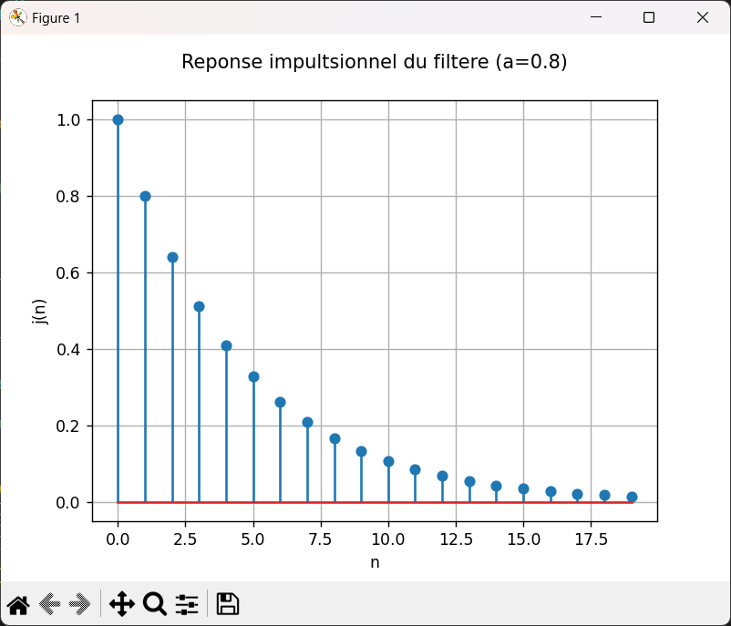
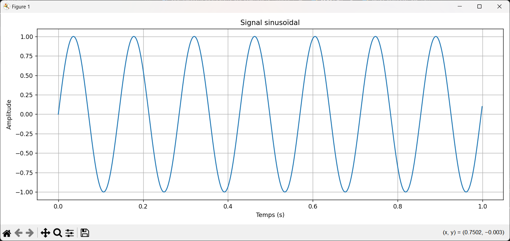
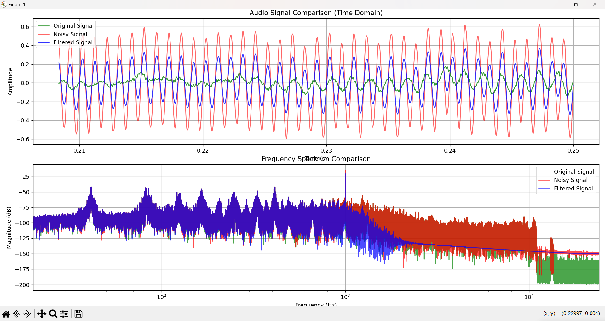
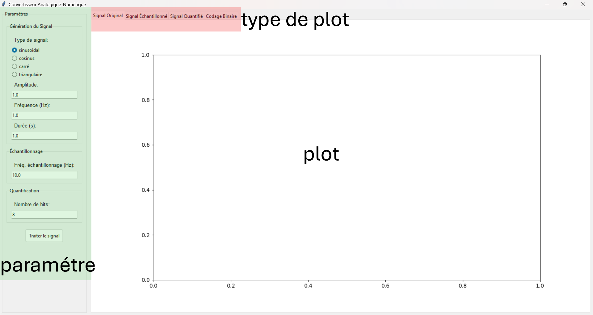
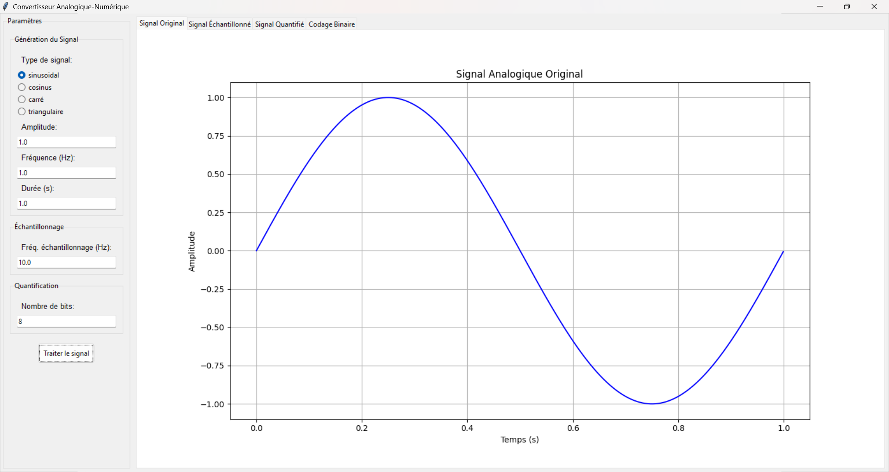
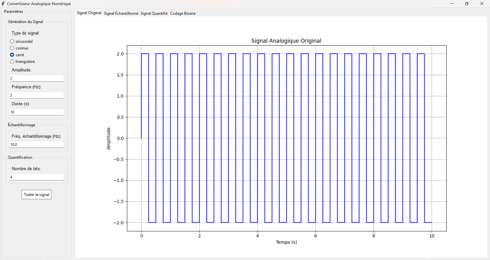
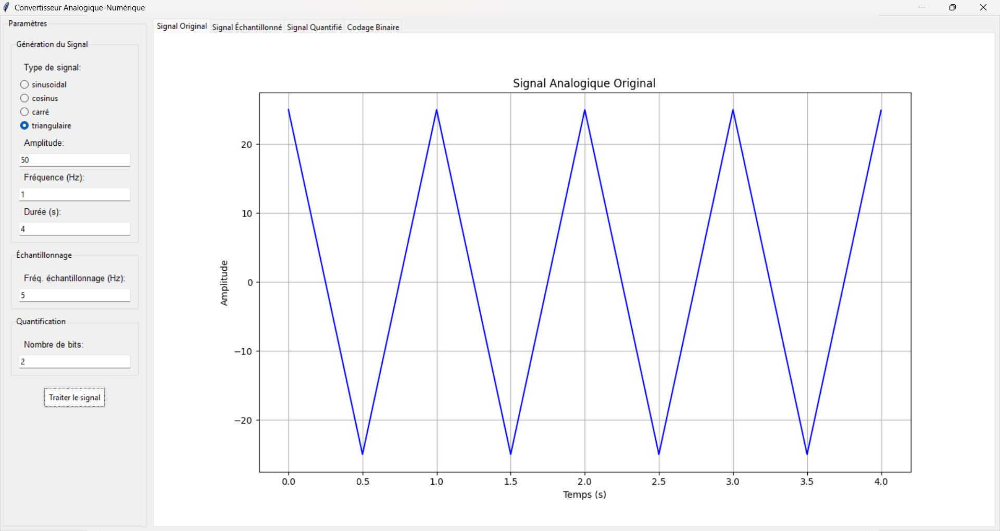

# Traitement du Signal - Projets et TP

**Réalisé par :** Hachem Squalli Elhoussaini (N°29)  
**Encadré par :** Pr. Hajar Touzani  


## 📌 Description du Projet
Ce dépôt contient une série de travaux pratiques en traitement du signal ainsi qu'un projet final implémentant un système complet de génération et d'analyse de signaux.

## 📂 Structure des TP

### TP1 - Filtrage Numérique
- Analyse temporelle et fréquentielle des filtres RIF
- Réponses impulsionnelles et étude de la fonction de transfert
- Exemple de résultat :
  

### TP2 - Conversion Analogique-Numérique
- Théorème d'échantillonnage et quantification
- Codage des signaux audio
- Visualisation :
  

### TP3 - Traitement Audio
- Analyse comparative signal original/bruité
- Filtrage de parasites haute fréquence
- Résultat spectral :
  

## 🎛 Projet Final - Générateur de Signaux
Application complète avec interface graphique pour :
- Génération de 4 types de signaux
- Échantillonnage et quantification paramétrables
- Visualisation des étapes de conversion

Exemples d'interface :


Signaux générés :
| Sinusoidal | Carré | Triangulaire |
|------------|-------|--------------|
|  |  |  |

## 🛠 Technologies Utilisées
- **Langage :** Python
- **Bibliothèques principales :**
  - `tkinter` (interface graphique)
  - `numpy`/`scipy.signal` (traitement du signal)
  - `matplotlib` (visualisation)
  - `librosa`/`pygame` (traitement audio)

## ▶ Comment Exécuter
1. Installer les dépendances :
```bash
pip install numpy matplotlib scipy librosa pygame
```
2. Lancer le projet principal :
```bash
python projet_signal_Hachem_Squalli_Elhoussaini_N29/main.py
```

## 📝 Rapports Complets
- [TP1](Hachem_Squalli_Elhoussaini_N°29_TP1_Compte_rendu/Hachem_Squalli_Elhoussaini_N°29_TP1_Compte_rendu.pdf)
- [TP2](Hachem_Squalli_Elhoussaini_N°29_TP2_Compte_rendu/Hachem_Squalli_Elhoussaini_N°29_TP2_Compte_rendu.pdf)
- [TP3](Hachem_Squalli_Elhoussaini_N°29_TP3_Compte_rendu/Hachem_Squalli_Elhoussaini_N°29_TP3_Compte_rendu.pdf)

---

🔹 *Projet académique - Licence MIT - 2024*
